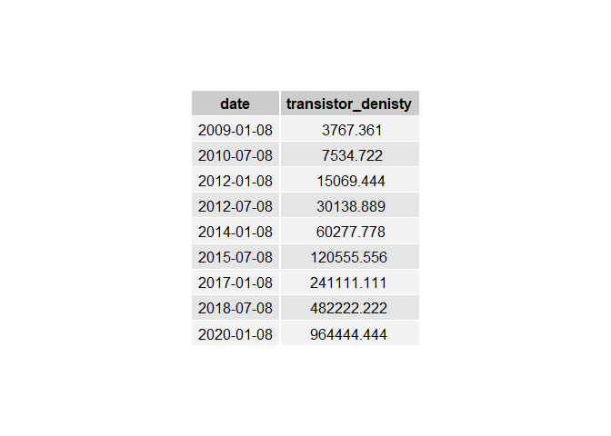
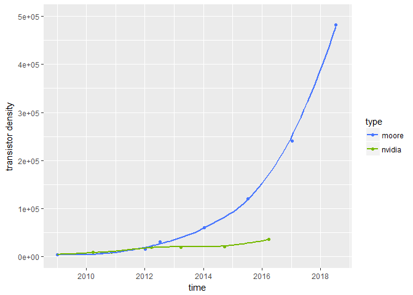
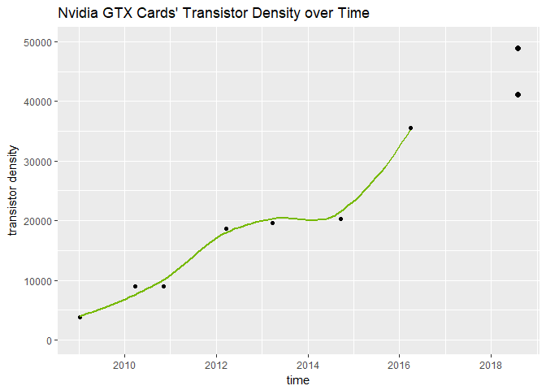
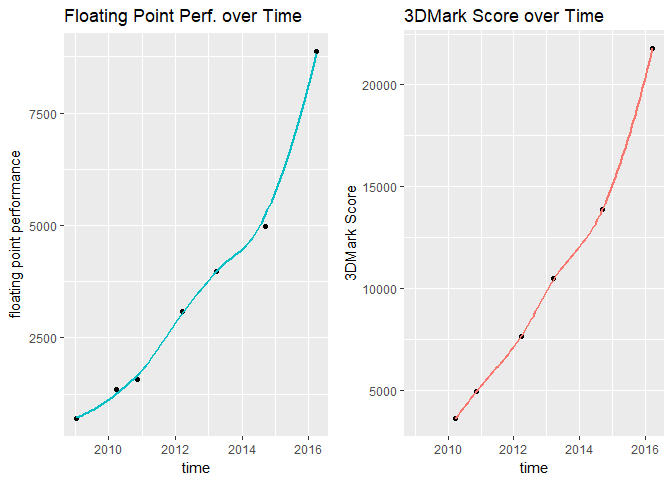
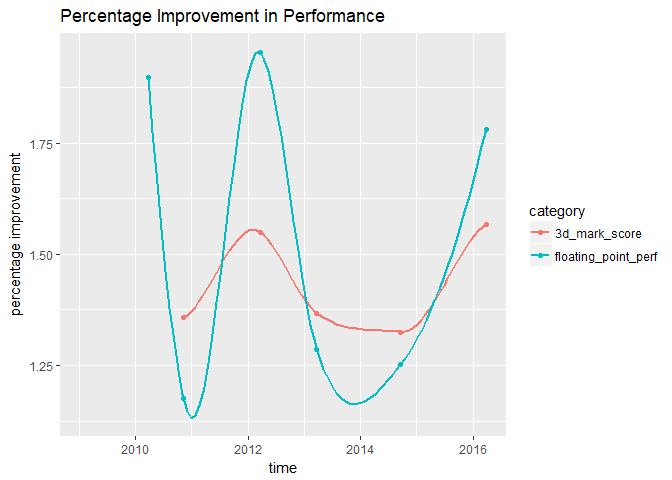

Approach
--------

``` r
Sys.setenv(LANG = "en")
library(car)
library(dplyr)
library(ggplot2)
library(gridExtra)
library(knitr)
library(kableExtra)
```

First bring in the data. Looking at all the cards from the GTX 280 to the current GTX 1080. The most important metrics that are going to help here are floating point performance, synthetic benchmarks, game benchmarks, and transistor count. These tend to be positively correlated with the overall performance of a graphics card, whereas something like memory speed or bus size really depends on the nature of the current architecture.

``` r
xx80 <- read.csv("xx80.csv", sep = ";")
xx80
```

    ##   ï..model     launch transistors_millions die_size cuda_cores core_speed
    ## 1   GTX280 2009-01-08                 1400      576        240        648
    ## 2   GTX480 2010-03-26                 3000      520        448        700
    ## 3   GTX580 2010-11-09                 3000      520        512        772
    ## 4   GTX680 2012-03-22                 3540      294       1536       1110
    ## 5   GTX780 2013-03-23                 7080      561       2304       1002
    ## 6   GTX980 2014-09-18                 5200      398       2048       1253
    ## 7  GTX1080 2016-03-27                 7200      314       2560       1800
    ##   shader_speed memory_speed pixel_rate texture_rate memory_size_gb
    ## 1         1476         2484     20.736        51.84            1.0
    ## 2         1401         3696     33.600        42.00            1.5
    ## 3         1544         4008     37.050        49.41            1.5
    ## 4         1006         1110     32.200       128.80            2.0
    ## 5           NA         1502     41.410       160.50            3.0
    ## 6           NA         1753     77.820       155.60            4.0
    ## 7           NA         1376    110.900       277.30            8.0
    ##   bandwidtch bus processing_power_single processing_power_double tdp price
    ## 1    159.000 512                  708.48                      NA 204   649
    ## 2    177.400 384                 1344.96                  168.12 250   499
    ## 3    192.384 384                 1581.10                  197.63 244   499
    ## 4    192.256 256                 3090.43                  128.77 195   499
    ## 5    288.400 384                 3976.70                  165.70 250   649
    ## 6    224.400 256                 4981.00                  155.60 165   549
    ## 7    320.300 256                 8873.00                  277.30 180   599

Transistor Density
------------------

Rescale the data for transistor density in terms of transistors per square inch.

``` r
transistor_density <- xx80$transistors_millions/xx80$die_size
scaled_transistor_density <- xx80$transistors_millions*1000000/xx80$die_size*0.00155
grid.table(data.frame("card" = xx80[,1], "transistor_denisty" = scaled_transistor_density), rows = NULL)
```



Moore's Law predicts that the number of transistors per square inch doubles each 18 months. This may be helpful in predicting future Nvidia transistor density. Let's create another vector using Moore's Law. Use GTX 280 transistor density as starting point, and increase by a factor of two every 18 months.

``` r
moore_predicted_scaled_transistory_density <- rep(scaled_transistor_density[1], 9)*c(1,2,4,8,16,32,64,128,256)
moore_dates <- c("2009-01-08", "2010-07-08", "2012-01-08", "2012-07-08", "2014-01-08", "2015-07-08", "2017-01-08", "2018-07-08", "2020-01-08")

grid.table(data.frame("date" = moore_dates, "transistor_denisty" = moore_predicted_scaled_transistory_density), rows = NULL)
```



Let's see where Nvidia's transistor density is compared to Moore's Law.

``` r
transistor_df <- data.frame("date" = c(as.Date(xx80$launch), as.Date(moore_dates)), "transistors" = c(scaled_transistor_density, moore_predicted_scaled_transistory_density), "type" = c(rep("nvidia", 7), rep("moore", 9))) 

ggplot(transistor_df, aes(x = date, y = transistors, color = type)) + geom_point() + geom_smooth(se=FALSE) + scale_color_manual(values=c("royalblue1", "#76b900")) + xlim(as.Date("2009-01-08"), as.Date("2018-08-02")) + ylim(0, 500000) + labs(x = "time", y = "transistor density")
```

    ## `geom_smooth()` using method = 'loess'


It looks like Nvidia's progression in transitor density has not kept up with Moore's Law. This makes sense, as it becomes increasingly more difficult with each generation to keep up such progress. Let's create a linear model regressing past GTX graphics cards' transistor densities against time. While the specific release date of each graphics card is definitely important, it's better to avoid using them as factors. Instead, we take the predictor variable, time, as continuous. This helps a lot more with the model's accuracy, especially since, to us, the release date of each graphics card is more or less arbitrary and in the control of Nvidia.

``` r
nvidia_transistors <- data.frame("date" = as.Date(xx80$launch), "transistors" = scaled_transistor_density)
moore_transistors <- data.frame("date" = as.Date(moore_dates), "transistors" = moore_predicted_scaled_transistory_density)

nvidia_transistor_model <- lm(transistors ~ date, data = nvidia_transistors)
summary(nvidia_transistor_model)
```

    ## 
    ## Call:
    ## lm(formula = transistors ~ date, data = nvidia_transistors)
    ## 
    ## Residuals:
    ##       1       2       3       4       5       6       7 
    ##   408.2   807.9 -1655.3  2674.6  -381.3 -5568.7  3714.6 
    ## 
    ## Coefficients:
    ##               Estimate Std. Error t value Pr(>|t|)    
    ## (Intercept) -1.506e+05  2.259e+04  -6.667 0.001146 ** 
    ## date         1.080e+01  1.458e+00   7.410 0.000704 ***
    ## ---
    ## Signif. codes:  0 '***' 0.001 '**' 0.01 '*' 0.05 '.' 0.1 ' ' 1
    ## 
    ## Residual standard error: 3337 on 5 degrees of freedom
    ## Multiple R-squared:  0.9165, Adjusted R-squared:  0.8999 
    ## F-statistic: 54.91 on 1 and 5 DF,  p-value: 0.0007045

A linear fit seems to be pretty good. There's a significant slope with an incredibly low p-value. However, this can be made better. While Nvidia's transistor density improvments don't happen at the logarithmic level Moore's Law suggests, the growth is certainly more than linear. Power transform close to 0.5 suggests a square root transformation on y. New model is now more accurate.

``` r
powerTransform(nvidia_transistors[,2])
```

    ## Estimated transformation parameter 
    ## nvidia_transistors[, 2] 
    ##               0.3664345

``` r
nvidia_transistor_model_2 <- lm(sqrt(transistors) ~ date, data = nvidia_transistors)
summary(nvidia_transistor_model_2)
```

    ## 
    ## Call:
    ## lm(formula = sqrt(transistors) ~ date, data = nvidia_transistors)
    ## 
    ## Residuals:
    ##       1       2       3       4       5       6       7 
    ##  -8.391   5.651  -4.223  16.216   3.614 -17.502   4.636 
    ## 
    ## Coefficients:
    ##               Estimate Std. Error t value Pr(>|t|)    
    ## (Intercept) -5.475e+02  8.147e+01  -6.720  0.00111 ** 
    ## date         4.331e-02  5.258e-03   8.237  0.00043 ***
    ## ---
    ## Signif. codes:  0 '***' 0.001 '**' 0.01 '*' 0.05 '.' 0.1 ' ' 1
    ## 
    ## Residual standard error: 12.03 on 5 degrees of freedom
    ## Multiple R-squared:  0.9314, Adjusted R-squared:  0.9176 
    ## F-statistic: 67.85 on 1 and 5 DF,  p-value: 0.0004297

Now we use both models to predict transistor densities for an estimated release GTX 1180 release date of August 1, 2018. Divide each by the GTX 1080's transistor density to calculate what the GTX 1180's percentage increase in transistor density will be. We plot our new predicted transistor densities on our graph. It looks like we can expect anywhere between **15.6%** and **37.4%** boost in transistor density with the new GTX 1180.

``` r
#predicted performance boost by transistor density through nvidia linear model
predict(nvidia_transistor_model, newdata = data.frame("date" = as.Date("2018-08-01")), type = "response")/nvidia_transistors[7,2] - 1
```

    ##         1 
    ## 0.1559908

``` r
#predicted performance boost by transistor density through nvidia transformed model
predict(nvidia_transistor_model_2, newdata = data.frame("date" = as.Date("2018-08-01")), type = "response")^2/nvidia_transistors[7,2] - 1
```

    ##         1 
    ## 0.3742506

``` r
ggplot(nvidia_transistors, aes(x = date, y = transistors,)) + geom_point() + geom_smooth(se=FALSE,  color = "#76b900") + xlim(as.Date("2009-01-08"), as.Date("2018-8-02")) + ylim(0, 50000) + labs(x = "time", y = "transistor density") + geom_point(aes(x=as.Date("2018-08-01"), y=predict(nvidia_transistor_model, newdata = data.frame("date" = as.Date("2018-08-01")), type = "response")), shape = 16, color = "black", size = 2) + geom_point(aes(x=as.Date("2018-08-01"), y=predict(nvidia_transistor_model_2, newdata = data.frame("date" = as.Date("2018-08-01")), type = "response")^2), shape = 16, color = "black", size = 2) + ggtitle("Nvidia GTX Cards' Transistor Density over Time")
```

    ## `geom_smooth()` using method = 'loess'



Synthetic Benchmarks
--------------------

Synthetic benchmarks are generally helpful in gauging performance. While their accuracy can sometimes be susceptible to driver issues and software problems, we are going to take them at face-value here.

First add the 3dMark score, a longstanding synthetic benchmark. We already have data for the floating point performance in the xx80 dataframe. Now let's take a look at how these two performance metrics look over time.

``` r
xx80$threedmark_score <- c(NA, 3649, 4952, 7672, 10490, 13898, 21787)
xx80$threedmark_score
```

    ## [1]    NA  3649  4952  7672 10490 13898 21787

``` r
xx80$processing_power_single
```

    ## [1]  708.48 1344.96 1581.10 3090.43 3976.70 4981.00 8873.00

``` r
p1 <- ggplot(xx80, aes(x = as.Date(launch), y = processing_power_single)) + geom_point() + geom_smooth(se=FALSE, color = "#00BFC4") + labs(x = "time", y = "floating point performance") + ggtitle("Floating Point Perf. over Time")
p2 <- ggplot(xx80, aes(x = as.Date(launch), y = threedmark_score)) + geom_point() + geom_smooth(se=FALSE, color = "#F8766D") + labs(x = "time", y = "3DMark Score") + ggtitle("3DMark Score over Time")
grid.arrange(p1,p2, ncol =2, nrow =1)
```

    ## `geom_smooth()` using method = 'loess'
    ## `geom_smooth()` using method = 'loess'



Looking at the floating point performance, we can create a linear model. Floating point perfromance tends to be follow transistor density extremely closely. We can apply the same transformation as we did on the transistor density model. Use the predict function on both models. Looks like we can expect anywhere between **10,097.98** and **12,328.65** FLOPs with the new GTX 1180.

``` r
tflop_data <- data.frame("date" = as.Date(xx80$launch), "score" = xx80$processing_power_single)

tflop_model <- lm(score ~ date, tflop_data)
summary(tflop_model)$r.squared
```

    ## [1] 0.9251189

``` r
powerTransform(tflop_data[,2])
```

    ## Estimated transformation parameter 
    ## tflop_data[, 2] 
    ##       0.0868053

``` r
tflop_model2 <- lm(sqrt(score) ~ date, tflop_data)
summary(tflop_model2)$r.squared
```

    ## [1] 0.9815361

``` r
predict(tflop_model, newdata = data.frame("date" = as.Date("2018-08-01")), type = "response")
```

    ##        1 
    ## 10097.98

``` r
predict(tflop_model2, newdata = data.frame("date" = as.Date("2018-08-01")), type = "response")^2
```

    ##        1 
    ## 12328.65

Now let's look at the percentage increase in 3DMark Score and floating point performance between the generations. Interesting to see that big performance boosts seem to happen every other generation. This indicates we are in for a big upgrade.

``` r
xx80$threedmark_percentage <- xx80$threedmark_score/c(1, xx80$threedmark_score[1:6])
xx80$processing_power_single_percentage <- xx80$processing_power_single/c(NA, xx80$processing_power_single[1:6])

bench_percentage <- data.frame("card" = rep(c(280, 480, 580, 680, 780, 980, 1080),2), "percentage_imporvement" = c(xx80$processing_power_single_percentage, xx80$threedmark_percentage), "category" = c(rep("floating_point_perf", 7), rep("3d_mark_score", 7)), "date" = rep(xx80$launch, 2))

ggplot(bench_percentage, aes(x = as.Date(date), y = percentage_imporvement, color = category)) + geom_point() + geom_smooth(se=FALSE) + labs(x = "time", y = "percentage improvement") + ggtitle("Percentage Improvement in Performance")
```

    ## `geom_smooth()` using method = 'loess'



``` r
xx80$processing_power_single_percentage
```

    ## [1]       NA 1.898374 1.175574 1.954608 1.286779 1.252546 1.781369

Investigating Time Between Launches
-----------------------------------

GTX 480, 680, and 1080 were *big* performance improvements. GTX 580, 780, and 980 were *small* performance improvements. Given the time since the last release is 1.88 times greater than the average time in between releases, we can assume we are in for a significant performance boost with this next generation. Given this information, I'd place my money on our transformed models over the linear models so far.

``` r
as.Date(as.character(xx80$launch[2:7])) - as.Date(as.character(xx80$launch[1:6]))
```

    ## Time differences in days
    ## [1] 442 228 499 366 544 556

``` r
mean(as.Date(as.character(xx80$launch[2:7])) - as.Date(as.character(xx80$launch[1:6])))
```

    ## Time difference of 439.1667 days

``` r
as.Date(as.character("2018-07-05")) - as.Date(as.character(xx80$launch[7]))
```

    ## Time difference of 830 days

``` r
830/440
```

    ## [1] 1.886364

Game Benchmarks
---------------

Thanks to TechSpot for their aggregated 1080p and 1600p benchmarks here. They are known for accurate benchmarks, so this should not be a problem.

``` r
xx80$average_game_perf_1080p <- c(NA, 21, 24, 40, 56, 77, 127)
xx80$average_game_perf_1600p <- c(NA, 30, 35, 53, 71, 109, 161)
```

Using our predicted floating point performance metric from our our previous transformed linear model to make a prediction on 1080p and 1600p gaming performance in average frames per second. We should see a **40%** increase in 1080p performance and a **78%** increase in 1600p performance.

``` r
game_synthetic_scores <- data.frame("date" = as.Date(xx80$launch), "game_perf_1080p" = xx80$average_game_perf_1080p, "game_perf_1600p" = xx80$average_game_perf_1600p, "tflop" = xx80$processing_power_single, "threedmark" = xx80$threedmark_score)
```

``` r
game_synthetic_1080p_model <- lm(game_perf_1080p ~ tflop, data = game_synthetic_scores)
summary(game_synthetic_1080p_model)$r.squared
```

    ## [1] 0.9932335

``` r
game_synthetic_1600p_model <- lm(game_perf_1600p ~ tflop, data = game_synthetic_scores)
summary(game_synthetic_1600p_model)$r.squared
```

    ## [1] 0.9753941

``` r
predict(game_synthetic_1080p_model, newdata = data.frame("tflop" = 12328.65, type = "response"))
```

    ##        1 
    ## 177.4223

``` r
predict(game_synthetic_1080p_model, newdata = data.frame("tflop" = 12328.65, type = "response"))/127
```

    ##        1 
    ## 1.397026

``` r
predict(game_synthetic_1600p_model, newdata = data.frame("tflop" = 12328.65, type = "response"))
```

    ##        1 
    ## 226.2672

``` r
predict(game_synthetic_1600p_model, newdata = data.frame("tflop" = 12328.65, type = "response"))/127
```

    ##        1 
    ## 1.781631
